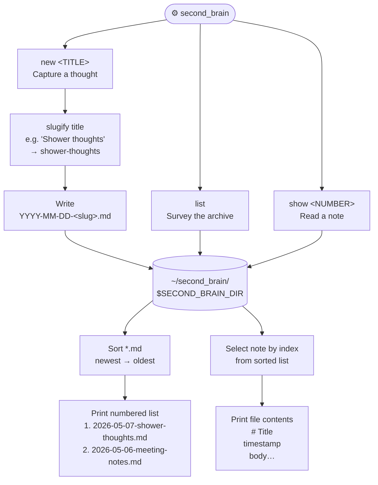

# second_brain CLI Commands

```mermaid
flowchart TD
    CLI(["⚙️ second_brain"])

    CLI --> NEW["new &lt;TITLE&gt;\nCapture a thought"]
    CLI --> LIST["list\nSurvey the archive"]
    CLI --> SHOW["show &lt;NUMBER&gt;\nRead a note"]

    NEW --> SLUG["slugify title\ne.g. 'Shower thoughts'\n→ shower-thoughts"]
    SLUG --> FILE["Write\nYYYY-MM-DD-&lt;slug&gt;.md"]
    FILE --> DIR[("~/second_brain/\n$SECOND_BRAIN_DIR")]

    LIST --> DIR
    DIR --> SORTED["Sort *.md\nnewest → oldest"]
    SORTED --> OUTPUT["Print numbered list\n1. 2026-05-07-shower-thoughts.md\n2. 2026-05-06-meeting-notes.md"]

    SHOW --> DIR
    DIR --> PICK["Select note by index\nfrom sorted list"]
    PICK --> CONTENT["Print file contents\n# Title\ntimestamp\nbody…"]
```
